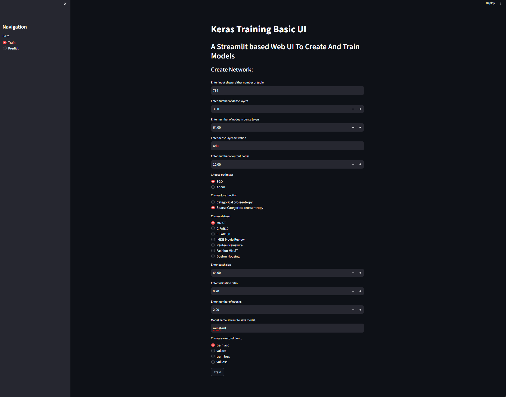
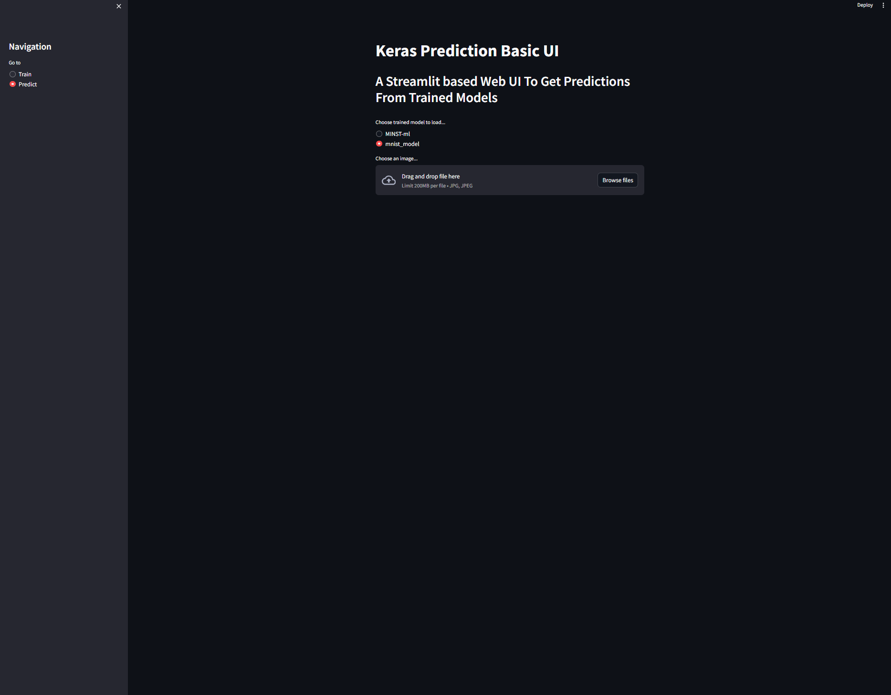

# Train-Predict-Models-UI
UI to train and predict models made usign Streamlit and Keras.

To run this project clone this repo:
```
git clone https://github.com/mkahoush-dev/Train-Predict-Models-UI.git
```

Then run main.py with streamlit

```
streamlit run .\main.py
```

## Training




## Predicting



Adapted from Shubhaditya Goswami
